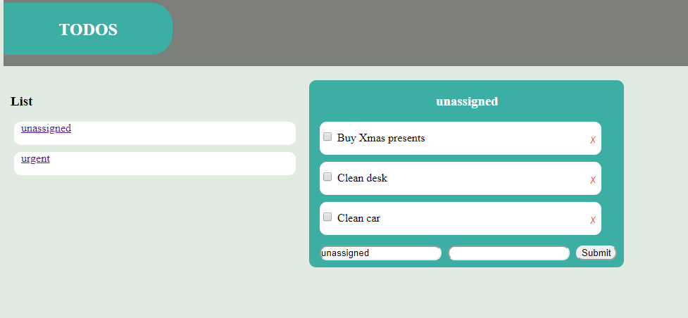

## Project Overview

### todo_flask
The goal of the projet was to get some more pratical experience with flask

### How to run
1. Download or clone the folder.
2. Install all need libs:
     ```
    $ pip install -r requirements.txt 
    ``` 
3. Start your local server e.g. 
    ```
    $ python app.py
    ``` 
### Screenshot
